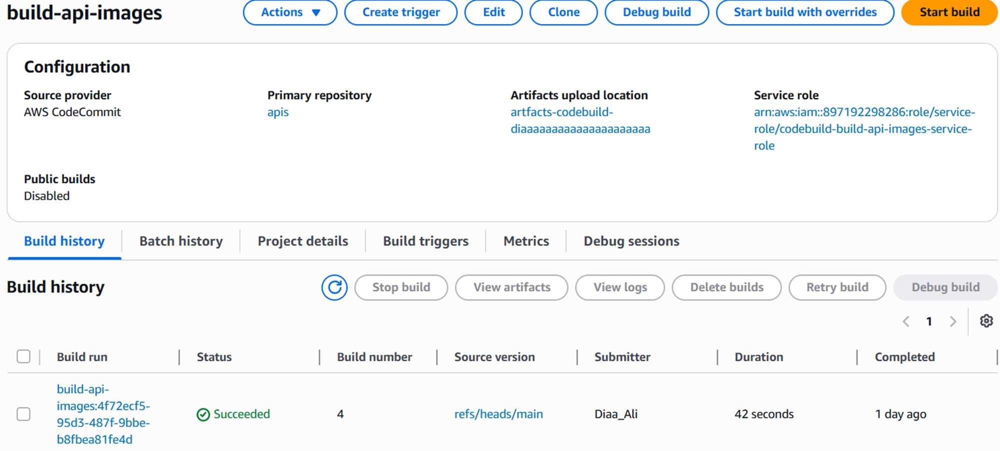
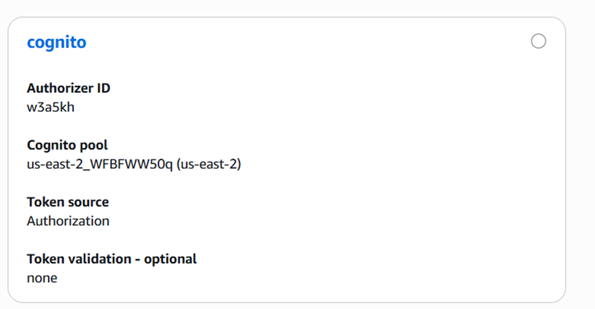
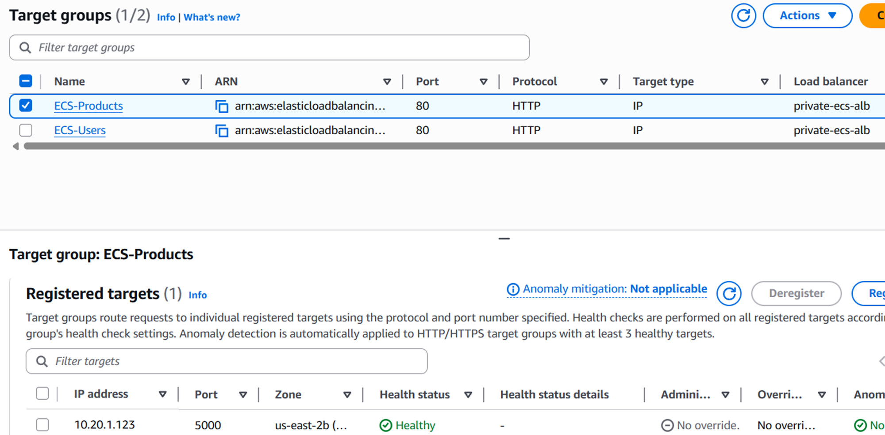
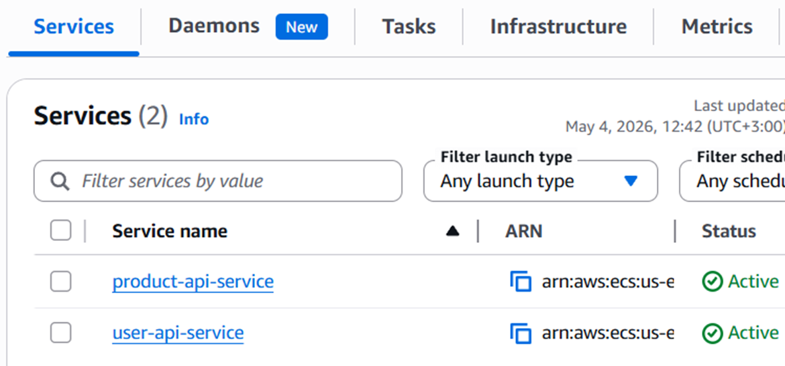
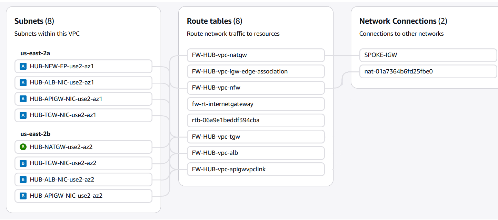
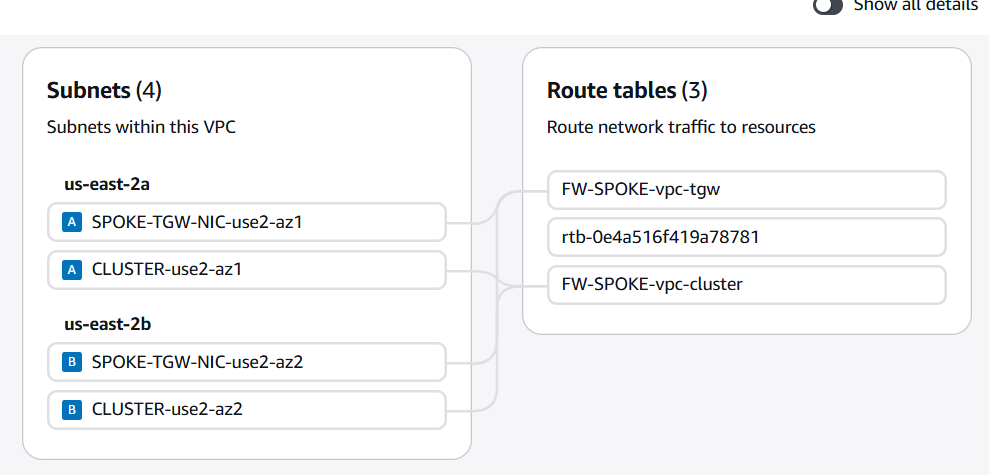

# Secure Multi-Region Hub-and-Spoke Microservices Architecture on AWS

This repository contains a reference implementation and deployment assets for a **secure, multi-region, hub-and-spoke microservices architecture** on AWS. It includes two Flask-based microservices (Users and Products), DynamoDB single-table data modeling, and supporting infrastructure diagrams and screenshots.

## Repository layout

- `Users/` — Flask Users API (`unified.py`) with Cognito integration and DynamoDB access.
- `Products/` — Flask Products API (`unified_Products.py`) backed by DynamoDB.
- `dynamodb-table/` — helper scripts + schema artifacts for the `onlineStore` table.
- `api-tester.html` — lightweight HTML UI for exercising the APIs.
- `buildspec.yml` — CodeBuild pipeline steps for container builds and ECR pushes.
- `sceenshots/` — architecture diagrams and service screenshots used throughout this README.

## Architecture overview (full architecture)

The deployment follows a hub-and-spoke VPC design with shared services in the hub and workload isolation in spokes. API Gateway provides the front door, VPC Link connects to the internal ALB, and ECS services run the microservices in private subnets. The architecture is designed for multi-region resiliency with disaster recovery and data replication patterns.


Additional architecture diagrams are available in `sceenshots/Full-architecture/diagrams/` (CI/CD, DR, data replication, ALB/ECS, and front-door views).

## Ingress flow (API request path)

The ingress flow shows how client requests reach the microservices through API Gateway and internal load balancing.


**High-level request path**

1. Client requests reach **API Gateway** (front door).
2. **Cognito authorizer** validates identities when enabled.
3. API Gateway uses **VPC Link** to reach the private **ALB**.
4. ALB routes to **ECS services** (Users & Products).
5. Services read/write the **DynamoDB `onlineStore`** table.
6. Responses are returned to the client through the same path.

## Microservices

### Users API

- Code: `Users/unified.py`
- Usage guide: [`Users/API_USAGE.md`](Users/API_USAGE.md)
- Supports user CRUD, lookups by email, and optional Cognito provisioning.

### Products API

- Code: `Products/unified_Products.py`
- Usage guide: [`Products/API_USAGE.md`](Products/API_USAGE.md)
- Supports product CRUD, category queries, and supplier-based filtering.

## Data model

Both services share a **single-table DynamoDB design**. Key attributes and GSI details are documented in:

- `Users/DYNAMODB_ATTRIBUTES.md`
- `Products/DYNAMODB_ATTRIBUTES.md`

## Local development

> Both services are standard Flask apps listening on port 5000.

### Users API

```bash
cd Users
python -m venv .venv
source .venv/bin/activate
pip install -r requirements.txt

# required environment variables
export DYNAMODB_TABLE=onlineStore
# optional, for Cognito provisioning
export COGNITO_USER_POOL_ID=your_user_pool_id

python unified.py
```

### Products API

```bash
cd Products
python -m venv .venv
source .venv/bin/activate
pip install -r requirements.txt

export DYNAMODB_TABLE=onlineStore

python unified_Products.py
```

> Make sure your AWS credentials and region are set so the services can reach DynamoDB.

## Container build & CI/CD

- Dockerfiles live in `Users/Dockerfile` and `Products/Dockerfile`.
- `buildspec.yml` shows the CodeBuild steps to build and push both images to ECR.
- `docker-cmd.txt` includes manual Docker build/push commands.



## Screenshots (from `sceenshots/`)

### API Gateway & Auth





### ALB & ECS




### Networking (Hub/Spoke VPCs)




### API Tester UI


## Diagram index (full-architecture/diagrams)

The following diagrams are available under `sceenshots/Full-architecture/diagrams/`:

- `hub-spoke.svg` — overall hub-and-spoke architecture
- `ingress flow.svg` — ingress flow detail
- `frontdoor.svg` — front door/API entry diagram
- `alb+ecs.svg` — compute & load balancing
- `CICD.svg` — build and deployment flow
- `DR.svg` — disaster recovery view
- `datareplication.svg` — cross-region data replication

---

If you need a walkthrough of any specific diagram, open the corresponding SVG or PDF in the `sceenshots/Full-architecture/` folder.
